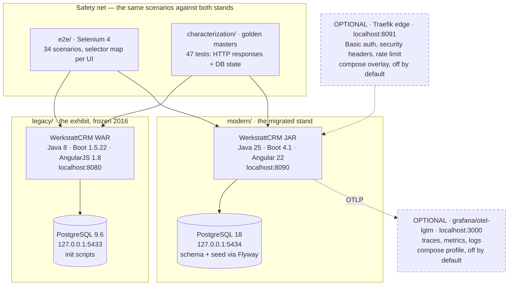
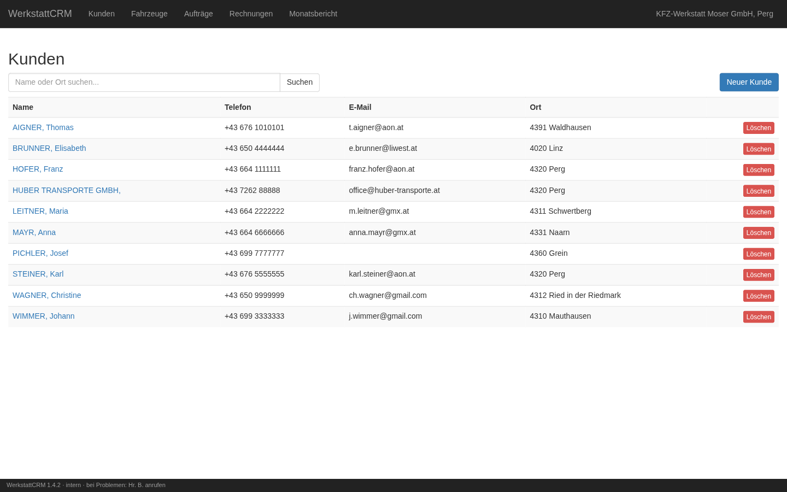
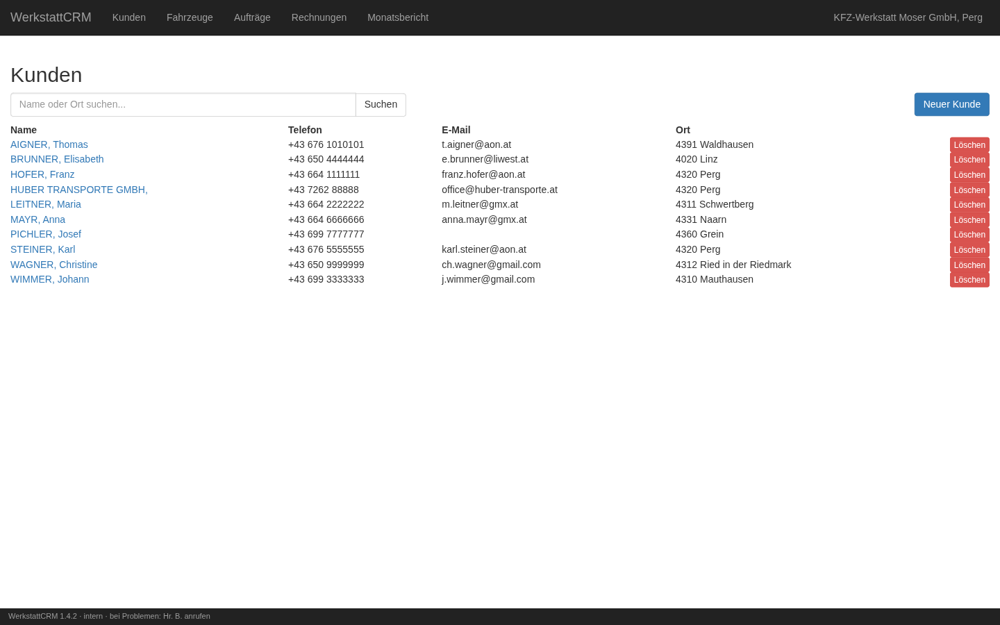

# migration-lab

[](https://github.com/Stoicera/migration-lab-java/actions/workflows/legacy-ci.yml)
[](https://github.com/Stoicera/migration-lab-java/actions/workflows/modern-ci.yml)
[](https://github.com/Stoicera/migration-lab-java/actions/workflows/e2e.yml)
[](https://github.com/Stoicera/migration-lab-java/actions/workflows/ai-testgen.yml)
[](https://github.com/Stoicera/migration-lab-java/actions/workflows/deploy.yml)

**A public, reproducible legacy modernization:**
Java 8 / Spring Boot 1.5 / AngularJS 1.8 → Java 25 / Spring Boot 4.1 / Angular 22 —
safety net first, honest numbers, reusable German migration playbook.

> **Status: all six stages done — v1.0.0, deployed.**
> The modern stand runs Spring Boot 4.1.0 / Java 25 with an Angular 22 UI, migrated
> route by route via Strangler Fig, the same Selenium scenarios green on the old AND
> the new UI — functionally equivalent to the frozen 2016 stand for all legitimate
> inputs (the deliberate divergences — security fix, absorbed admin page, fixed
> "undefined" alert — are registered and pinned per stand in
> [ADR-0004](docs/adr/0004-functional-equivalence-and-sanctioned-divergence.md)).
> **G6 closed (2026-08-02): measured AI test generation**, protocol **frozen before
> anything ran** (tag `ai-testgen-protocol-v1`), 24 calls for €0.65, both phases
> measured in [`ai-testgen/REPORT.md`](ai-testgen/REPORT.md). The result is the
> unflattering one: as generated, 12 of 24 classes compiled and *looked* perfect
> (100 % coverage, 99.2 % mutation score); after repair brought 21 of 24 green, the
> same metrics fell to **90.5 % line / 73.2 % mutation** — the perfect figures had been
> computed only over the cells that happened to compile, i.e. the easy ones.
> **Survivorship bias, measured and published rather than quietly kept.** Six repaired
> test classes were adopted into `modern/` (88 methods,
> [ADR-0011](docs/adr/0011-adopting-generated-tests.md)), lifting its coverage 37 % → **81 %**.
> **Stage 6 closed 2026-08-14 with the deployment it was waiting for:** both stands
> live on the Stoicera fleet — [migration-lab.stoicera.cyou](https://migration-lab.stoicera.cyou)
> (modern, public) and [migration-lab-legacy.stoicera.cyou](https://migration-lab-legacy.stoicera.cyou)
> (the 2016 exhibit, **entirely behind Basic auth** — it preserves SQL injection on
> purpose) — TLS, nightly backups with an **executed** restore rehearsal, tag
> `stage-6-cloud-ops`, release v1.0.0. The nine days between the measured ops half
> (2026-08-05) and the deployment are visible in the history, not smoothed over.
> Progress: [`stages.md`](stages.md) · [`docs/worklog.md`](docs/worklog.md).

## Why this exists

Companies and institutes sit on Java-8/Spring-Boot-1.x/AngularJS applications
(AngularJS EOL since January 2022, Spring Boot 1.x EOL since 2019). Migrations get
postponed because legacy systems have no tests, the risk feels incalculable, and
vendors demand blind trust. This repository shows — publicly, step by step, with
measured effort numbers — how such a migration is de-risked:

1. **Safety net before anything else:** a Selenium E2E suite and characterization
   tests define functional equivalence *before* the first migration commit — and
   must stay green through every stage.
2. **Reproducible stages:** every stage is a git tag; checkout → `docker compose up`
   → working application. See [`stages.md`](stages.md).
3. **Measured AI-assisted test generation (G6, closed 2026-08-02):** LLM-generated unit
   tests for the same six classes **twice** — once as 2016 legacy, once as their
   migrated counterparts — evaluated with JaCoCo coverage **and PIT mutation scores**
   under a protocol that was frozen before the first API call
   ([`ai-testgen/PROTOCOL.md`](ai-testgen/PROTOCOL.md), tag `ai-testgen-protocol-v1`).
   Both phases are measured and reported in [`ai-testgen/REPORT.md`](ai-testgen/REPORT.md),
   including the finding that the flattering Phase-A numbers were survivorship bias.
   Failures stay in the repo.
4. **A German migration playbook** ([`playbook/`](playbook/)) with honest effort
   figures and decision rules, reusable for real projects.

## How this was built — read this before reusing any number

**The execution was AI-assisted: a Claude Code agent performed the work, directed
and reviewed by the owner.** This is disclosed here, at the front door, because it
changes how the numbers transfer:

- **The logged hours are agent wall-clock time under supervision** — the five
  backend stages took ~4 wall-clock hours on 2026-07-30, against a human-team
  plan estimate of ~5 focused weeks ([`docs/MILESTONES.md`](docs/MILESTONES.md)).
  Do **not** price a human migration from these hours; price the *method* (stage
  order, safety-net-first, break catalogue) and see the playbook's separately
  labelled experience-based estimates.
- **What does transfer:** the migration path, the breaks the net caught and how,
  the decision rules, the tooling evaluations (e.g. OpenRewrite's catch/miss
  list) — those are properties of the stacks, not of who typed.
- **Review model:** solo maintainer; "owner reviewed" means author-is-reviewer,
  hardened by commissioned adversarial reviews whose findings are public
  (worklog session 7) and were remediated in the open
  ([ADR-0008](docs/adr/0008-ci-enforcement-and-solo-review.md)).
- The app is small on purpose: **~1.7k LOC backend, 25 REST endpoints, 10 views**
  — big enough to exhibit real breaks, small enough to stay fully honest.
  Scaling caveats are in every playbook chapter.

## Architecture

Two stands run side by side on one machine, and one safety net drives both. That is
the whole trick: equivalence is not argued, it is executed against the old and the
new system with the same scenarios.



Reading notes, because two details in that picture are load-bearing:

- **The databases are deliberately different versions.** Legacy keeps PostgreSQL 9.6
  for ever — it is the exhibit, end-of-life included. Only the modern stand moved to
  18 (stage 6). What that costs and what it caught is below.
- **The two optional boxes are genuinely optional.** Neither is part of the quickstart:
  the edge is a separate compose overlay, observability a compose profile. The safety
  net targets the application ports directly, so the edge is not in the equivalence path
  by default. That is a default and not an enforced invariant — the suite accepts a
  `-DbaseUrl`, and pointing it at the edge on purpose is exactly how the CSP finding
  below was produced.

## Stages

Git tags are first-class deliverables: `git checkout <tag>` → `docker compose up` →
working application. Long form, including what broke in each stage:
[`stages.md`](stages.md).

| Tag | What it delivers | Playbook chapter | Status |
|-----|------------------|------------------|--------|
| `stage-0-legacy` | WerkstattCRM as found: Java 8, Boot 1.5.22, AngularJS 1.8.2, JSP admin page, PostgreSQL 9.6, **no tests** | Ausgangslage in ch. 1 | **done** (2026-07-30) |
| `stage-1-safety-net` | Selenium E2E suite + characterization tests green against legacy; CI gates active — from here on no commit may break them | [Kap. 1](playbook/01-ohne-netz-keine-migration.md) | **done** (2026-07-30) |
| `stage-2-jdk-build` | `modern/` bootstrapped as a faithful copy running side by side; logging unified; JDK deliberately NOT raised yet | [Kap. 2](playbook/02-fundament-build-und-jdk.md) | **done** (2026-07-30) |
| `stage-3-boot-2.7` | Boot 1.5.22 → 2.7.18 + Java 17; three real breaks, one of them invisible in the UI and caught only by the golden master | [Kap. 3](playbook/03-der-weite-sprung-boot-27.md) | **done** (2026-07-30) |
| `stage-4-boot-4x` | Boot 2.7 → 3.5 → 4.1 + Java 25; OpenRewrite used AND evaluated; SQL-injection wart closed as a registered divergence | [Kap. 4](playbook/04-boot-3-4-java-25-und-openrewrite.md) | **done** (2026-07-30) |
| `stage-5-angular` | AngularJS → Angular 22.1.0 via Strangler Fig on a URL seam, no ngUpgrade; JSP admin page absorbed; WAR → JAR | [Kap. 5](playbook/05-angularjs-nach-angular-22.md) | **done** (2026-07-31) |
| `stage-6-cloud-ops` | Operations and hardening: PostgreSQL 18, Flyway, Actuator health probes, OTel, edge auth, load baseline — **deployment still open** | [Kap. 7](playbook/07-betrieb-und-haertung.md) | **in progress** (G7) — ops half measured 2026-08-05; **tag not created** |

The AI test-generation experiment (G6) is not a migration stage; it carries one tag of
its own, `ai-testgen-protocol-v1`, which is a **pre-registration marker, not a
checkout-and-run state**, and its results live in [`ai-testgen/`](ai-testgen/) and
[Kap. 6](playbook/06-ki-testgenerierung-gemessen.md). That chapter is why the numbering
runs one ahead of the stages from here on: a non-stage milestone took chapter 6, so
stage 6 gets chapter 7. Renaming it quietly would have been the easier and the more
dishonest option.

## Where stage 6 stands (measured 2026-08-05)

Everything in this section was measured on one machine on 2026-08-05 and is written
down with its caveats in [`docs/worklog.md`](docs/worklog.md); the decisions have ADRs
(0012–0015) in [`docs/adr/`](docs/adr/).

### Delivered

- **PostgreSQL 9.6 → 18 on the modern stand**, legacy untouched. The safety net saw no
  change: characterization **47/47 green against both stands**, and
  `/api/bericht/topkunden` — the one endpoint whose raw DB types reach JSON — answers
  **byte-identically** on both, decimal literals included. The trap on the way is the
  interesting part: `postgres:18-alpine` **reports** `datcollate=en_US.utf8` and sorts
  in C order anyway (musl accepts the locale name and ignores it). A review step that
  reads the setting passes while every sorted list in the application silently changes
  order. The stand therefore runs `postgres:18`, not `-alpine`, and there is now a test
  that sorts instead of asking.
- **Schema and demo seed via Flyway** instead of a mounted init script. Measured failure
  on the way, kept in the repo: in Boot 4, `flyway-core` alone migrates *nothing* — the
  app starts, then dies later on `relation "kunde" does not exist`. Silent, not loud.
  `spring-boot-starter-flyway` is the missing piece. The CI drift guard was rewritten
  (`scripts/check-schema-drift.sh`) so a deleted file fails loudly instead of turning
  the guard green; verified with a negative control.
- **Health that tells the truth.** Actuator exposes `health` and `info` and nothing else
  (`/env`, `/beans`, `/mappings`, `/metrics`, `/loggers`, `/heapdump` measured as 404).
  The default readiness group does **not** contain the database: with the DB stopped,
  readiness answered `200 UP` while `/actuator/health` answered `503`. After the fix and
  a corrected retry budget, measured end to end: the container goes **unhealthy 25 s**
  after the database dies and **healthy again 6 s** after it returns. The old TCP probe
  never noticed at all. Liveness deliberately still ignores the database — a DB outage
  must not restart a healthy application.
- **Structured logs and tracing**: ECS JSON in the container only (a bare `java -jar`
  stays human-readable), log↔trace correlation measured working after renaming Micrometer's
  MDC keys to the ECS field names. Tracing is off by default; the observability profile
  starts a single `grafana/otel-lgtm` container for a local demonstration.
- **Security at the edge** (optional Traefik overlay): Basic auth in front of `/admin`,
  `/api/admin` and `/actuator`, security headers, per-IP rate limit. Verified by
  `modern/edge/verify-edge.sh`: unauthenticated → 401 on all four protected paths,
  authenticated → 200, public surface unaffected, and 200 concurrent requests → **103–173 × 429** over five runs
  through the edge versus **0 × 429** straight at the application.
- **A load baseline, one scenario** (`load/k6/lesepfad.js`, 5 VUs, 45 s, 1146 requests
  per stand, 0 failures). The result is the unflattering one:
  **the modernisation is not measurably faster** — p(95) 1.60 ms modern versus 1.56 ms
  legacy. Ten years of framework and JDK versions bought supportability, security and a
  labour market, not speed on this workload. Anyone selling a migration on performance
  should measure first.
- **A gap in the safety net itself, found and closed.** The E2E suite silently ignored
  `-Dstand=modern` and ran green against the *legacy* stand. Same class of bug the
  characterization side fixed one session earlier — a guard on one side of a symmetric
  mistake is half a guard. Both flags are now validated eagerly and the wrong one aborts
  the run.

### Not delivered

- **No deployment happened.** There is no host, no Dokploy project, no domain, no TLS,
  no `pg_dump` schedule and no published image. The repository has no GitHub secrets at
  all, so a deploy workflow would fail at runtime — none was written, rather than
  committing one that cannot run.
- **Therefore the tag `stage-6-cloud-ops` does not exist and v1.0.0 is not released.**
  Stage 6 is in progress, and saying otherwise would be exactly the smoothing this
  repository exists to argue against.
- OAuth2/OIDC, an audit log and Angular's `CSP_NONCE` remain owner-scoped in
  [`docs/DEVIATIONS.md`](docs/DEVIATIONS.md). Basic auth at the edge is a lock on the one
  door that deletes data, not an identity system, and it is described as such.

## Repository layout

| Directory | Content |
|-----------|---------|
| [`legacy/`](legacy/) | WerkstattCRM as found (2016-era, deliberately untested) — the exhibit |
| [`modern/`](modern/) | The migrated application, growing stage by stage; since stage 6 also the edge overlay (`modern/edge/`) |
| [`e2e/`](e2e/) | Selenium 4 suite — same scenarios vs. both UIs via selector maps |
| [`characterization/`](characterization/) | Golden-master tests = the definition of functional equivalence |
| [`ai-testgen/`](ai-testgen/) | Pre-registered AI test-generation experiment (G6) — protocol, harness, runs and the full report of both phases |
| [`load/`](load/) | k6 read-path scenario, run against both stands (one scenario, by design) |
| [`scripts/`](scripts/) | Repository guards used by CI, e.g. the schema-drift check |
| [`playbook/`](playbook/) | German playbook, one chapter per stage |
| [`docs/`](docs/) | PRD, SPEC, milestones, ADRs, worklog, deviations ledger, glossary, deployment and manual-task docs |

## Quickstart

Needs only Docker with the Compose plugin — the applications build inside Docker.

```bash
docker compose -f legacy/docker-compose.yml up -d --wait
# SPA: http://localhost:8080 · JSP admin: http://localhost:8080/admin
docker compose -f modern/docker-compose.yml up -d --wait
# modern stand: http://localhost:8090
```

`--wait` blocks until the healthchecks pass. Without it the containers are merely *running* —
PostgreSQL is not yet accepting connections, and the next test run fails on timing.

The two optional add-ons stay off unless asked for:

```bash
# observability: Grafana + Prometheus + Tempo + Loki in one container, on 127.0.0.1:3000
WERKSTATT_TRACING_ENABLED=true \
  docker compose -f modern/docker-compose.yml --profile observability up -d --wait

# reverse proxy with Basic auth, security headers and rate limiting, on :8091
MODERN_ADMIN_AUTH='admin:$apr1$...' \
  docker compose -f modern/docker-compose.yml -f modern/docker-compose.edge.yml up -d --wait
```

Everything else — prerequisites per module, resetting the database, troubleshooting —
is in [`docs/deployment.md`](docs/deployment.md). The by-hand steps are checklisted in
[`docs/MANUAL_TASKS.md`](docs/MANUAL_TASKS.md).

## Testing

The safety net is the product's spine, so it is one command per suite, and both stands
must answer the same way:

```bash
# characterization — the equivalence gate (47 tests per stand)
./mvnw verify -f characterization/pom.xml
./mvnw verify -f characterization/pom.xml \
  -DbaseUrl=http://localhost:8090 -DdbUrl=jdbc:postgresql://localhost:5434/werkstatt -Dstand=modern

# Selenium E2E (34 scenarios per stand)
./mvnw verify -f e2e/pom.xml -Dtarget=legacy
./mvnw verify -f e2e/pom.xml -Dtarget=modern

# modern module build incl. Angular, lint/format gates and Testcontainers
./mvnw verify -f modern/pom.xml
```

Both suites fail loudly if zero tests are discovered, and each rejects the *other*
suite's stand flag instead of quietly running against the wrong target. Last measured
on 2026-08-05: characterization 47/47 and E2E 34/34 green against both stands. The
levels above these suites (unit, ArchUnit, Testcontainers integration, k6 load) and
what each is for are described in
[`docs/ENGINEERING_STANDARDS.md`](docs/ENGINEERING_STANDARDS.md) §3 and
[`docs/deployment.md`](docs/deployment.md) §5.

## Deployment

**Both stands run live on the Stoicera fleet since 2026-08-14** — every step executed
before it was documented ([`docs/deployment.md`](docs/deployment.md) §10, decisions in
[ADR-0016](docs/adr/0016-deployment-dokploy-stoicera-fleet.md)):

| | URL | Access |
|---|---|---|
| Modern stand | <https://migration-lab.stoicera.cyou> | public; `/admin`, `/api/admin`, `/actuator` behind Basic auth (ADR-0014's boundary, now with TLS in front) |
| Legacy stand | <https://migration-lab-legacy.stoicera.cyou> | **entirely behind Basic auth, credential on request** — it preserves SQL injection (SD-1) and an EOL database on purpose; the exhibit goes public gated or not at all |

Images are built by CI and pulled from GHCR (`deploy.yml`); the application ports are
not published on the host — the only way in is the host's Traefik on 443, carrying the
same middleware values the local edge overlay measures with `verify-edge.sh`. Nightly
`pg_dump` backups run on the host, and the restore rehearsal was **executed**, not
planned (kunde 10/10, fahrzeug 13/13, auftrag 16/16, rechnung 8/8 on both stands,
2026-08-14). Live verification: [`deploy/verify-live.sh`](deploy/verify-live.sh).
The data on both stands is the synthetic ten-customer seed; public visitors can mutate
the modern stand's copy, and the backup doubles as the reset path.

## Screenshots

The two stands **as deployed**, same screen, ten years apart — captured from the live
instances on 2026-08-14. They look almost identical, and that is the point: functional
equivalence is the product, and the same Selenium scenarios pass on both.

| 2016 — AngularJS 1.8 on Spring Boot 1.5 | 2026 — Angular 22 on Spring Boot 4.1 |
|---|---|
|  |  |

## Honest limits

- The legacy application is **synthetic but pattern-faithful** — built from real
  legacy smells, transparently catalogued (`legacy/LEGACY_NOTES.md`), because no
  suitable genuinely abandoned, permissively licensed OSS application exists
  (research documented in [ADR-0001](docs/adr/0001-synthetic-legacy-application.md)).
  The catalogue includes deliberate security warts — among them a flagged
  SQL-injection-shaped search (B4), fixed in the modern stand in stage 4 and told
  as the playbook's security story.
- **Small scale, disclosed exactly:** ~1.7k LOC backend / 25 endpoints / 10 views.
  Numbers do not scale linearly to 500k-LOC systems; each playbook chapter states
  what does and does not generalize.
- **The safety net has a blind spot, and it was found the hard way.** With a strict
  `style-src 'self'` at the edge, the E2E suite ran 32 of 34 green while the browser was
  blocking Angular's runtime-injected component styles. Selenium asserts behaviour and
  text, not appearance. It was found only by opening a real browser and reading the
  console; `verify-edge.sh` now pins `script-src 'self'` verbatim and states the blind
  spot in its own output. A green suite can prove less than it appears to.
- **The stands no longer share a database version** (9.6 legacy vs. 18 modern). The
  orderings and the report payloads were measured equal *on this seed*, on 2026-08-05 —
  that is evidence, not a proof that collation cannot matter.
- The load numbers are a comparison baseline, not a capacity statement: load generator,
  application and database shared one laptop, and the dataset is a 10-customer demo seed.
- Effort figures are AI-agent wall-clock time (see *How this was built*); the
  playbook labels measured values and experience-based estimates separately.
- AI-experiment results are model- and date-specific; the protocol pins both.
- Known standards deviations are ledgered in [`docs/DEVIATIONS.md`](docs/DEVIATIONS.md)
  — nothing is silently waived.

---

## Deutsche Kurzfassung

**migration-lab** ist eine öffentlich nachvollziehbare Legacy-Modernisierung:
Java 8 / Spring Boot 1.5 / AngularJS → Java 25 / Spring Boot 4.1 / Angular 22.

Der professionell entscheidende Schritt kommt zuerst: ein **Sicherheitsnetz** aus
Selenium-E2E-Suite und Charakterisierungs-Tests, das während der gesamten Migration
grün bleiben muss. Jede Etappe ist ein auscheckbarer Git-Tag mit lauffähigem
Docker-Compose-Stand. Sackgassen werden dokumentiert statt gelöscht, und das
KI-Testgenerierungs-Experiment folgt einem **vorab festgeschriebenen Protokoll**
mit Mutation-Testing-Auswertung (PIT).

**Stand heute:** Etappen 0–5 sind abgeschlossen, Etappe 6 (Betrieb und Härtung) läuft.
Gemessen erledigt sind PostgreSQL 18, Flyway-Migrationen, aussagekräftige Health-Checks,
strukturierte Logs mit optionalem Tracing, ein Reverse Proxy mit Authentifizierung,
Security-Headern und Rate Limit sowie eine Last-Messbasis. **Nicht erledigt ist die
Inbetriebnahme selbst:** Es läuft nichts öffentlich, es gibt keinen Server, kein TLS und
keine Sicherungen — folglich existiert weder der Tag `stage-6-cloud-ops` noch ein
Release v1.0.0. Das steht hier so, weil das Weglassen genau die Schönfärberei wäre,
gegen die dieses Repository argumentiert.

**Transparenz zur Entstehung:** Die Umsetzung erfolgte KI-gestützt — ein
Claude-Code-Agent hat unter Anleitung und Review des Inhabers gearbeitet. Die
geloggten Stunden ([`docs/worklog.md`](docs/worklog.md)) sind **Agent-Wall-Time
unter Aufsicht**, keine Personentage eines Teams; was auf reale Projekte übertragbar
ist (Methode, Stolperfallen, Entscheidungsregeln) und was nicht (die Stundenzahlen),
steht oben unter *How this was built* und in jedem Playbook-Kapitel.

Das Ergebnis für Entscheider: ein **deutschsprachiges Migrations-Playbook**
([`playbook/`](playbook/)) mit Vorgehen, Stolperfallen, transparent gekennzeichneten
Aufwänden und Entscheidungsregeln — wiederverwendbar für reale
Modernisierungsprojekte.

Ein Projekt von [Stoicera Software Group](https://stoicera.com) ·
[Lugmayr-Kern](https://lugmayrkern.at), Oberösterreich.

## License

[Apache-2.0](LICENSE)
